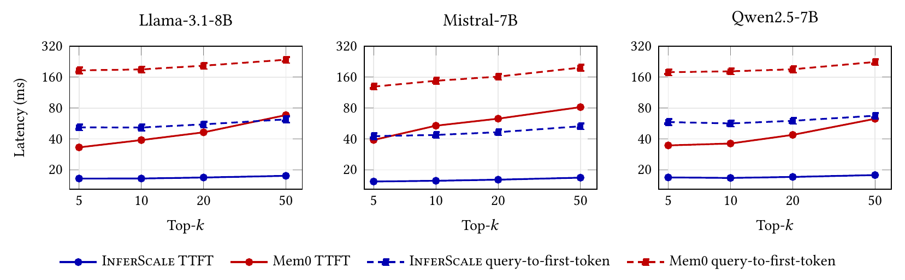
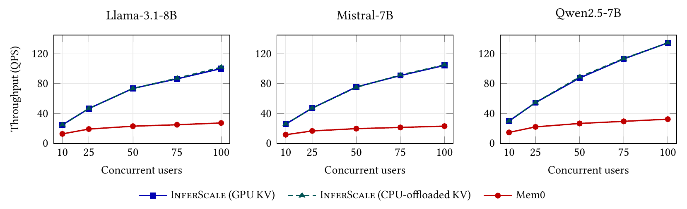

# InferScale: GPU-Native KV Injection for Personalized LLM Serving

Paper: [InferScale: GPU-Native KV Injection for Personalized LLM Serving](https://arxiv.org/abs/2607.27090) (arXiv:2607.27090)

## 1. Requirements

The setup targets a Linux GPU host; the reference environment is a Runpod container with the persistent `/workspace` partition.

- GPU: one NVIDIA GPU with CUDA >=12.8.
- Python >=3.10,<3.14.
- CMake and the CUDA toolkit, used to build the `jasperpy` submodule.
- Hugging Face API key (`HF_TOKEN` for gated models such as Llama 3.1) and an OpenAI API key for `text-embedding-3-small` embedding calls.

We configure all default parameters to run on an RTX Pro 6000 GPU with 96 GB of VRAM.

## 2. Setup

```bash
cp .env.example .env
```

Edit `.env` for your session.
The common values are:

- `BENCHMARK_RUNTIME_ROOT=/workspace`
- `CUDA_MODULE=` for Runpod containers without environment modules
- `OPENAI_API_KEY=...` for embeddings and Mem0 inference
- `HF_TOKEN=...` if the model is gated

Load the environment in each shell that will run the project's commands:

```bash
source scripts/load_env.sh
```

## 3. Optimize Jasper

There is a minor optimization we can make to Jasper. First initialize and update the Jasper submodule:

```bash
git submodule update --init --recursive jasperpy
```

To apply the optimization, edit `jasperpy/include/jasper/index/graph.cuh` and change line 70 to:

```cpp
static constexpr index_t vectors_per_segment = 1u << 12;
```

## 4. Install

For the quickstart, set `extract_facts` to `false` in `configs/setup.json`.

In `configs/runtime.json`, set `storage.runtime_root` to a writable directory; the default is `/workspace`, and `null` uses project-local storage.

```bash
bash scripts/setup_remote.sh
```

The script creates the virtual environment, installs InferScale and the pinned GPU dependencies, builds Jasper, and installs its Python bindings.

Load credentials and runtime paths into your current shell, then activate the configured environment:

```bash
source scripts/load_env.sh
source "${VENV_DIR}/bin/activate"
```

## Example usage

Run [examples/quickstart.py](examples/quickstart.py):

```bash
python examples/quickstart.py
```

The example precomputes four short context chunks, retrieves the two most relevant chunks, and answers “What is the name of Alice's cat?”
It prints the precomputed chunk and token counts, the generated answer, the engine's time to first token in milliseconds, and the retrieved chunk IDs.

The core API follows three steps: `precompute()`, `start()`, and `query()`:

```python
from inferscale.v1 import Chunk, InferScale, InferScaleConfig

config = InferScaleConfig(
    model="meta-llama/Llama-3.1-8B-Instruct",
    top_k=2,
    context_window=2,
)
chunks = [
    Chunk(id="c1", text="Alice moved to Berlin in March 2021."),
    Chunk(id="c2", text="Alice adopted a grey cat named Miso in 2023."),
]

with InferScale(config) as engine:
    engine.precompute(chunks)
    engine.start()
    result = engine.query("What is the name of Alice's cat?")
    print(result.text)
    print([hit.id for hit in result.hits])
```

## Benchmark Results

See [/benchmarks](benchmarks/README.md) for the memory and RAG experiments.

### Serving latency



InferScale keeps TTFT nearly flat as more memory is retrieved, while Mem0's prefill latency grows with `k`.

### End-to-end memory QA accuracy

Judged LoCoMo accuracy (%), micro-averaged over the 1,540 answerable questions.

#### Llama-3.1-8B

| Method | `k=5` | `k=10` | `k=20` | `k=50` |
| --- | ---: | ---: | ---: | ---: |
| InferScale (`w=0`) | 62.21 | 62.14 | 57.66 | 53.77 |
| InferScale (`w=5`) | 60.00 | 59.81 | 59.87 | 56.82 |
| InferScale (`w=20`) | 60.13 | 62.08 | 61.62 | 59.22 |
| InferScale (`w=50`) | 60.06 | 61.36 | 62.66 | 60.26 |
| Mem0 | 56.95 | 59.29 | 61.49 | 63.25 |

#### Mistral-7B

| Method | `k=5` | `k=10` | `k=20` | `k=50` |
| --- | ---: | ---: | ---: | ---: |
| InferScale (`w=0`) | 54.03 | 55.13 | 52.84 | 37.22 |
| InferScale (`w=5`) | 56.04 | 57.60 | 58.09 | 56.45 |
| InferScale (`w=20`) | 53.96 | 55.97 | 56.95 | 58.24 |
| InferScale (`w=50`) | 55.78 | 56.49 | 58.70 | 58.30 |
| Mem0 | 61.30 | 63.96 | 65.00 | 64.35 |

#### Qwen2.5-7B

| Method | `k=5` | `k=10` | `k=20` | `k=50` |
| --- | ---: | ---: | ---: | ---: |
| InferScale (`w=0`) | 59.74 | 56.75 | 54.22 | 50.45 |
| InferScale (`w=5`) | 59.29 | 57.53 | 58.05 | 57.40 |
| InferScale (`w=20`) | 60.00 | 59.68 | 58.25 | 58.64 |
| InferScale (`w=50`) | 58.83 | 58.25 | 58.18 | 58.77 |
| Mem0 | 60.06 | 63.64 | 65.13 | 64.61 |

Encoding each fact in isolation (`w=0`) trails Mem0 and degrades as more facts are retrieved, from 62.2% to 53.8% on Llama and, most steeply, 54.0% to 37.2% on Mistral as `k` grows from 5 to 50.

A context window reverses this: with `w>=20`, accuracy is flat-to-rising in `k` and comes within a few points of Mem0 (on Llama, 60.3% vs. 63.3% at `k=50`) while often exceeding it at small `k`.

### Serving throughput



InferScale's throughput scales near-linearly with the number of concurrent users, while Mem0 saturates early.

### Memory footprint and CPU offload

Average per-conversation storage footprint in decimal MB.

| Model | Jasper GPU | Fact-ID map CPU | Fact KVs GPU |
| --- | ---: | ---: | ---: |
| Llama-3.1-8B | 13.50 | 7.97 | 4,796.67 |
| Mistral-7B v0.3 | 13.50 | 3.02 | 2,257.44 |
| Qwen2.5-7B | 13.50 | 6.48 | 1,780.10 |

## Citation

If you use InferScale in your research, please cite:

```bibtex
@article{li2026inferscale,
  title         = {InferScale: GPU-Native KV Injection for Personalized LLM Serving},
  author        = {Li, Peter and Pandey, Prashant},
  journal       = {arXiv preprint arXiv:2607.27090},
  year          = {2026},
  eprint        = {2607.27090},
  archivePrefix = {arXiv},
  primaryClass  = {cs.DC},
  url           = {https://arxiv.org/abs/2607.27090}
}
```

## License

This repository is released under the BSD 3-Clause License; see [LICENSE](LICENSE).
