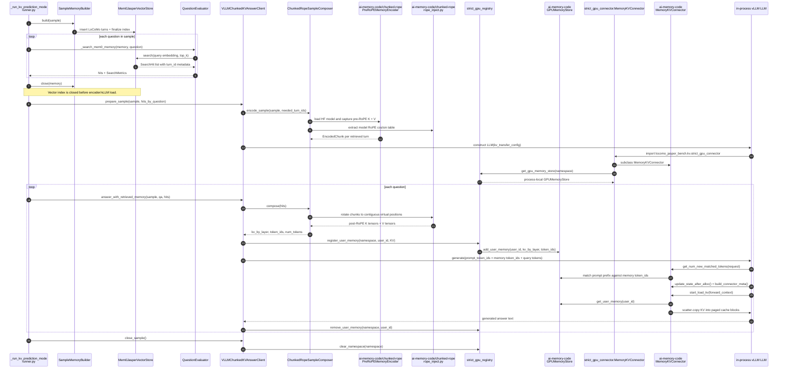

# ai-memory-code Architecture

This repository uses `ai-memory-code` in one opt-in answer path: strict GPU KV
injection for LoCoMo question answering. The normal benchmark path still uses
retrieved memory as prompt text; the KV path retrieves the same top-k turns, then
turns only those retrieved turns into GPU-resident KV tensors for vLLM.

## Component And Data Flow

```mermaid
flowchart LR
    cli["locomo-jasper-bench<br/>src/locomo_jasper_bench/run.py"]
    cfg["BenchmarkConfig<br/>answer_backend, vector_backend, KV options"]
    dataset["LoCoMo dataset<br/>data/locomo10.json"]
    runner["run_benchmark<br/>runner.py"]
    builder["SampleMemoryBuilder<br/>memory_builder.py"]
    mem0["Mem0 Memory<br/>infer=false turn ingestion"]
    cache["CachedEmbedder<br/>embedding cache"]
    adapter["Mem0JasperVectorStore<br/>mem0_adapter.py"]
    jasper["JasperVectorStore<br/>jasperpy GPU graph"]
    qdrant["QdrantVectorStore<br/>local qdrant-client"]
    search["QuestionEvaluator<br/>embed query + top-k search"]
    promptAnswer["OpenAICompatibleChatClient<br/>retrieved text in prompt"]
    kvAnswer["VLLMChunkedKVAnswerClient<br/>strict GPU KV path"]
    judge["Judge client<br/>OpenAI-compatible chat"]
    results["Run artifacts<br/>config.json, system.json,<br/>predictions.jsonl, summary.json"]

    cli --> cfg --> runner
    dataset --> runner
    runner --> builder
    builder --> mem0
    mem0 <--> cache
    mem0 --> adapter
    adapter -->|--vector-backend jasper| jasper
    adapter -->|--vector-backend qdrant| qdrant
    jasper --> search
    qdrant --> search
    search -->|SearchHit list with turn metadata| promptAnswer
    search -->|SearchHit list with turn metadata| kvAnswer
    promptAnswer --> judge
    kvAnswer --> judge
    judge --> results

    subgraph NormalAnswerPath["answer_backend=openai"]
        promptAnswer
    end

    subgraph StrictGpuKvPath["answer_backend=vllm-kv"]
        kvAnswer
    end
```

The vector retrieval step is shared by both answer modes. Each LoCoMo turn is
inserted into Mem0 with metadata such as `sample_id`, `session_id`, `turn_id`,
speaker, timestamp, and turn index. Retrieval returns `SearchHit` objects whose
metadata is later used by the KV path to select the exact conversation turns to
encode.

In normal mode, `QuestionEvaluator.answer_from_hits()` formats retrieved memory
text into chat messages through `build_retrieval_answer_messages()`. In strict
GPU KV mode, the same evaluator detects that the answer client exposes
`answer_with_retrieved_memory()` and delegates to the KV client instead of
building a prompt with memory text.

## Strict GPU KV Injection Sequence

The local `strict_gpu_connector.MemoryKVConnector` intentionally keeps the
upstream connector mechanics but swaps the memory store to the process-local
registry namespace. It also forbids `memory_path` disk loads, so the strict path
does not use safetensors, `CPUMemoryStore`, vLLM CPU swap, or vLLM CPU offload.

## Boundaries And Responsibilities

- `benchmark-jasper` owns the benchmark loop, LoCoMo parsing, Mem0 ingestion,
  vector-store selection, answer/judge clients, result files, and the strict
  wrapper that wires `ai-memory-code` into an in-process vLLM run.
- `jasperpy` provides the GPU ANN graph used by `JasperVectorStore` when
  `--vector-backend jasper` is selected.
- `ai-memory-code/chunked-rope` provides the pre-RoPE memory encoder and RoPE
  rotation helpers used to compose retrieved chunks at request time.
- `ai-memory-code/memory_connector` provides the vLLM KV connector and
  `GPUMemoryStore` implementation that scatter-copy precomputed KV tensors into
  vLLM's paged attention cache.

## Runtime Modes

| Mode | Answer backend | Retrieval | Answer context |
| --- | --- | --- | --- |
| Baseline | `openai` | Mem0 + Jasper/Qdrant top-k | Retrieved memory text is inserted into the prompt. |
| Strict GPU KV | `vllm-kv` | Mem0 + Jasper/Qdrant top-k | Retrieved turns become GPU KV tensors injected before query tokens. |

Strict GPU KV mode currently supports `--kv-sample-window 1`. For each sample,
the benchmark retrieves all planned question memories, closes the vector index,
encodes the union of retrieved turn IDs, constructs in-process vLLM, answers the
sample's questions, and then clears the namespace before moving on.

